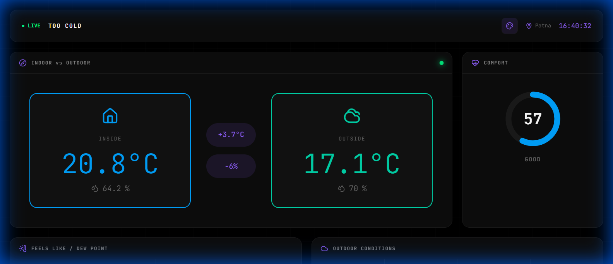

# 🥶 TOO Cold

A premium room climate monitoring dashboard that displays indoor sensor data alongside outdoor weather conditions.



## ✨ Features

- **Real-time Comparison**: Indoor vs Outdoor temperature and humidity
- **Comfort Score**: 0-100 score based on temp, humidity, and AQI
- **Advanced Metrics**: Dew Point, Feels Like (Heat Index)
- **24hr Statistics**: Min, Max, Average for temp and humidity
- **Historical Charts**: Line charts and comparison bar charts
- **5 Color Themes**: Customizable accent colors
- **API Status Dashboard**: Monitor all data sources
- **Sensor Status**: Connection status and last reading

## 🚀 Setup

### 1. Clone the Repository
```bash
git clone https://github.com/SrikantShubam/too-cold-in-my-room.git
cd too-cold-in-my-room
```

### 2. Configure Your API URL
```bash
# Copy the example config
cp config.example.js config.js

# Edit config.js with your Google Apps Script URL
```

### 3. Deploy to GitHub Pages
1. Go to repo Settings → Pages
2. Select "main" branch as source
3. Your dashboard will be live!

> **Note**: The `config.js` file is gitignored to protect your API URL. You'll need to create it on any machine where you run this locally.

## 📊 Data Sources

- **Indoor Data**: ESP32 sensor → Google Sheets → Google Apps Script API
- **Weather**: [Open-Meteo API](https://open-meteo.com/)
- **Air Quality**: [Open-Meteo AQI API](https://open-meteo.com/)

## 🛠️ Google Apps Script Setup

See `google-apps-script-api.gs` for the API code to deploy in Google Apps Script.

## 📝 License

MIT © [Srikant Shubham](https://github.com/SrikantShubam)
